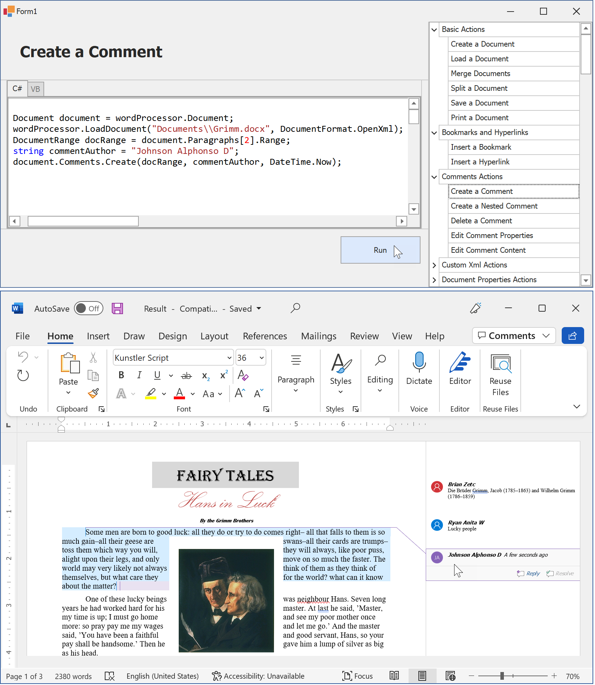

<!-- default badges list -->

<!-- default badges end -->

# Word Processing Document API – How to Process Word Documents in Code

The  [Word Processing Document API](https://docs.devexpress.com/OfficeFileAPI/17488/word-processing-document-api) is a non-visual .NET library that allows you to generate, load, modify, import, export, and print Microsoft Word documents in code. 

This example demonstrates how to use the Word Processing Document API to execute the following actions: 

- Create, load, merge, split, save, and print documents 
- Save a document in PDF and HTML formats 
- Convert an HTML file to PDF and DOCX formats 
- Format a document 
- Manage document elements (paragraphs, lists, tables, shapes, pictures, headers, footers, notes, watermarks, bookmarks, hyperlinks, and comments) 
- Insert and modify fields 
- Configure page layout settings 
- Specify the built-in and custom document properties 
- Protect and unprotect a document 
- Create character, paragraph, and linked styles 
- Import formatted text to a document 
- Add checkbox form fields to a document 
- Embed arbitrary XML data (custom XML parts) in a document 

The application’s form contains the list of supported operations and the editor that displays the code of these operations. A user can select an operation to view its code and click the **Run** button to open the resulting document in Microsoft Word. 

## Files to Look At

[CodeExamples](./CS/CodeExamples) (VB: [CodeExamples](./VB/CodeExamples))

## Documentation

- [Basic Actions](http://docs.devexpress.com/OfficeFileAPI/116811/word-processing-document-api/examples/files)
- [Document Elements](http://docs.devexpress.com/OfficeFileAPI/116861/word-processing-document-api/examples/document-elements) 
- [Hyperlinks and Bookmarks](http://docs.devexpress.com/OfficeFileAPI/15304/word-processing-document-api/word-processing-document/hyperlinks-and-bookmarks) 
- [Custom XML Parts](http://docs.devexpress.com/OfficeFileAPI/401609/word-processing-document-api/word-processing-document/custom-xml-parts) 
- [Document Properties](https://docs.devexpress.com/OfficeFileAPI/116865/word-processing-document-api/examples/document-elements/how-to-specify-document-properties) 
- [Export](http://docs.devexpress.com/OfficeFileAPI/116866/word-processing-document-api/examples/export) 
- [Document Conversion](http://docs.devexpress.com/OfficeFileAPI/119981/word-processing-document-api/examples/document-conversion) 
- [Fields](http://docs.devexpress.com/OfficeFileAPI/15280/word-processing-document-api/fields) 
- [Formatting](http://docs.devexpress.com/OfficeFileAPI/400460/word-processing-document-api/text-formatting) 
- [Checkbox Form Fields](http://docs.devexpress.com/OfficeFileAPI/120712/word-processing-document-api/word-processing-document/checkboxes) 
- [Headers and Footers](http://docs.devexpress.com/OfficeFileAPI/15310/word-processing-document-api/word-processing-document/headers-and-footers) 
- [Import and Export](http://docs.devexpress.com/OfficeFileAPI/15441/word-processing-document-api/import-and-export) 
- [Lists](http://docs.devexpress.com/OfficeFileAPI/15314/word-processing-document-api/word-processing-document/lists) 
- [Footnotes and Endnotes](http://docs.devexpress.com/OfficeFileAPI/401688/word-processing-document-api/word-processing-document/footnotes-and-endnotes) 
- [Page Layout](http://docs.devexpress.com/OfficeFileAPI/116854/word-processing-document-api/examples/layout) 
- [Protection](http://docs.devexpress.com/OfficeFileAPI/118639/word-processing-document-api/examples/protection)
- [Printing](http://docs.devexpress.com/OfficeFileAPI/119883/word-processing-document-api/examples/printing/how-to-print-a-document) 
- [Shapes](http://docs.devexpress.com/OfficeFileAPI/15315/word-processing-document-api/word-processing-document/shapes) 
- [Styles](http://docs.devexpress.com/OfficeFileAPI/116829/word-processing-document-api/examples/styles) 
- [Tables](http://docs.devexpress.com/OfficeFileAPI/116848/word-processing-document-api/examples/tables) 
- [Watermarks](http://docs.devexpress.com/OfficeFileAPI/403030/word-processing-document-api/word-processing-document/watermarks)
